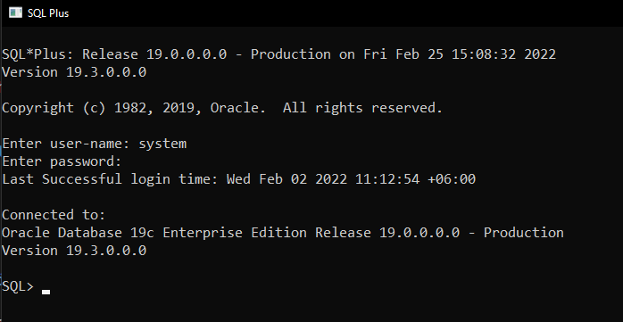

<h1 id="title" align="center">Welcome to BloodDonors Backend 👋</h1>

<h4 align="center">🚧 Blood donors backend project in development... 🚧</h4>

> A project to help you connect with blood donors and people who need blood.

### 🔖 Table Of Contents

- 🤔 [How To Run This Project In Your PC](#how-to-run)
- 🚀 [Technologies](#technologies)
- 🌱 [Minimal Requirements](#minimal-requirements)
- 🎊 [Features](#features)
  - 🎇 [Finished](#features-finished)
- 💡 [How To Contribute](#how-to-contribute)
- 🤗 [Authors and Contributors](#contributors)
- 👤 [Supervisor](#supervisor)
- 🔏 [License](#license)

---

<h2 id="how-to-run">🤔 How To Run This Project In Your PC</h2>

### 💻 Step-1: Clone the project in your pc

```sh
git clone https://github.com/hmasum52/BloodDonors-backend.git
```
or if you use ssh link
```sh
git clone git@github.com:hmasum52/BloodDonors-backend.git
```

### Step-2: Get the denpendencies

```sh
npm install
```  

### Step-3: Setting up the database

- Login in to your sqlplus as "system" user



- Then create a user and grant dba to that user.

```sql
create user c##<username> identified by <password>;
grant dba to c##<username>;
```
- After connecting the user to navicate or datagrip Run dump file in [sql/dump.sql](./sql/dump.sql) to create the database.

- Run the following command to see the triggers
```sql
SELECT * FROM USER_TRIGGERS;
```
### Step-4: Setting up the enviroment variables
Create create a new file .env in the root directory. And the file should have the followings

```
DB_USERNAME=c##<username>
DB_PASSWORD=<password>
DB_CONNECTION_STRING=localhost/orcl
JWT_SECRET=<user jwt secret>
PORT=<port number>
```

Example
```
DB_USERNAME=c##blood_donors
DB_PASSWORD=blood_donors
DB_CONNECTION_STRING=localhost/orcl
JWT_SECRET=hack_me_if_you_can
PORT=3000
```

### Step-5: Run the project 

```
npm start
```

or

```
npm run dev
```

### Step-6: Now you are ready to run the frontend

- [BloodDonors-frontend](https://github.com/AshfaqRahman/BloodDonors-frontend)

[Back To The Top](#title)

---

<h2 id="technologies">🚀 Technologies</h2>

- Node
- Javascript
- Express
- Oracle

[Back To The Top](#title)

---

<h2 id="minimal-requirements">🌱 Minimal Requirements</h2>

- NodeJs - v14.18.1+
- Oracle 19c

[Back To The Top](#title)

---

<h2 id="features">🎊 Features</h2>

<h4 id="features-finished">🎇 Finished</h4>

- [✔️] Authentication
- [✔️] APIs
- [✔️] Oracle connection

[Back To The Top](#title)

---

<h2 id="how-to-contribute">💡 How To Contribute</h2>

- Make a fork of this repository
- Clone to you machine and entry on respective paste
- Create a branch with your resource: `git checkout -b my-feature`
- Commit your changes: `git commit -m 'feat: My new feature'`
- Push your branch: `git push origin my-feature`
- A green button will appear at the beginning of this repository
- Click to open and fill in the pull request information

<p align="center">
<i>Contributions, issues and features requests are welcome!</i><br />
<i>📮 Submit PRs to help solve issues or add features</i><br />
<i>🐛 Find and report issues</i><br />
<i>🌟 Star the project</i><br />
</p>

[Back To The Top](#title)

---

<h2 id="contributors">👤 Author And Contributors</h2>

<p>

<a href="https://github.com/hmasum52">  
<a href="https://github.com/hmasum52">Hasan Masum</a>  

<a href="https://github.com/AshfaqRahman">  
<a href="https://github.com/AshfaqRahman">Ashfaq Rahman</a>

</p>

[Back To The Top](#title)

---

<h2 id="supervisor">👨‍💻 Supervisor</h2>

- [Mohammad Tawhidul Hasan Bhuiyan](https://cse.buet.ac.bd/faculty/facdetail.php?id=tawhid), Lecturer, Department of Computer Science and Engineering Bangladesh University of Engineering and Technology Dhaka-1000, Bangladesh

[Back To The Top](#title)

---

<h2 id="license">🔏 License</h2>

Copyright © 2022 [Hasan Masum <hasanmasum1852@gmail.com>](https://github.com/hmasum52)

This project is licensed by [MIT License](https://api.github.com/licenses/mit).

[Back To The Top](#title)

---
